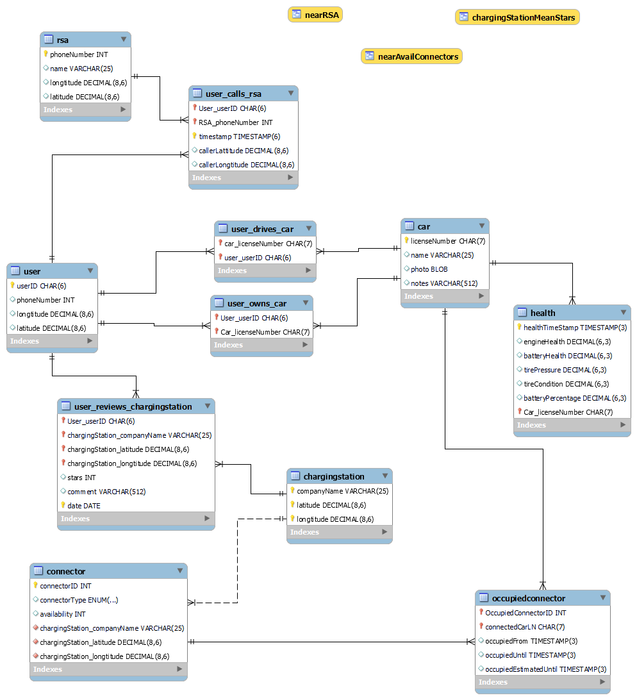

<p align="center"></p>

# EVPointDB

Relational database design and MySQL implementation for **EVPoint**, a mobile
web service that helps electric-vehicle drivers find charging stations, monitor
their car's health and call roadside assistance.

Course project for *Databases* (9th semester, School of Electrical and Computer
Engineering, Aristotle University of Thessaloniki, 2021), Group 39.

## Schema



The database `evpointdb` has 11 tables and 3 views.

- **Tables:** `user`, `car`, `user_drives_car`, `user_owns_car`, `health`,
  `chargingstation`, `connector`, `occupiedconnector`,
  `user_reviews_chargingstation`, `rsa` (roadside assistance) and `user_calls_rsa`.
- **Views:** `chargingStationMeanStars` (average review rating per station),
  `nearAvailConnectors` (available connectors near each user) and `nearRSA`
  (roadside assistance near each user).

`connector.availability` is `1` (available), `-1` (occupied) or `0` (out of service).

## Design

The course had two parts: first a written design of the database (what data
it stores, who uses it, and how it is modelled), then its implementation in
MySQL. The design is summarized below with the entity-relationship diagram and
the relational diagram. The full write-up (entities, relationships, user
categories, relations, views and the assumptions behind them) is in
[`docs/DESIGN.md`](docs/DESIGN.md).


*ER diagram (source: `EVP_ER.drawio`).*


*Relational diagram (source: `EVP_RD.drawio`). The `.drawio` files open in
[diagrams.net](https://app.diagrams.net). The MySQL Workbench model is
`src/EVPoint.mwb`.*

## Repository layout

| Path | Contents |
|---|---|
| `src/EVPoint_dump.sql` | Schema, views and sample data |
| `src/users.sql` | Example users, roles and privileges |
| `src/*_query.sql`, `src/best_near_connector.sql` | Example queries |
| `src/EVPoint.mwb` | MySQL Workbench model |
| `EVP_ER.drawio`, `EVP_RD.drawio` | ER and relational diagrams (editable sources) |
| `docs/DESIGN.md` | Design summary, condensed from the course report |
| `data/ocm_athens_snapshot.json` | Snapshot of real charging stations (Open Charge Map) |
| `tools/` | Scripts that download the snapshot and rebuild the sample data |
| `Assets/` | Images used in this README (schema, diagrams, logo) |

## Sample data

- **Real:** the charging stations and connector types are a snapshot of real stations
  around Athens from [Open Charge Map](https://openchargemap.org), taken on 2026-09-30
  and used under the
  [CC BY 4.0](https://creativecommons.org/licenses/by/4.0/) licence (data provider:
  Open Charge Map Contributors).
- **Fictional:** everything else. Users, cars, license plates, phone numbers, health
  readings, roadside-assistance companies, reviews, ratings, and which connectors are
  occupied are invented. The reviews and ratings say nothing about the real operators.

Both parts are generated by the scripts in `tools/` (Python 3, standard library only):

    python3 tools/build_sample_data.py     # rebuild the data in src/EVPoint_dump.sql

`tools/fetch_ocm.py` downloads a fresh snapshot. It needs a free Open Charge Map API key
in the `OCM_API_KEY` environment variable. On Windows, use `python` instead of `python3`.

## Requirements

MySQL 8.0 or newer, and a MySQL account that can create databases. MariaDB is
not supported: the dump uses MySQL 8 collations.

## Setup

Run these from the repository root. The same commands work on Windows
(PowerShell or cmd), macOS and Linux, because they avoid shell redirection
(`<`), which PowerShell does not support:

```
mysql -u <your_user> -p --default-character-set=utf8mb4 -e "source src/EVPoint_dump.sql"
```

Then check that it loaded:

```
mysql -u <your_user> -p evpointdb -e "SHOW FULL TABLES;"
```

Notes:

- **The dump drops and recreates `evpointdb`.** Any existing database with that
  name is deleted.
- **Linux / WSL:** on a default Ubuntu install, MySQL's `root` account logs in
  through the operating system, not a password. Use `sudo mysql ...` (no `-u`
  or `-p`), or create your own user first.
- **Character set:** the sample data is plain ASCII, so `--default-character-set=utf8mb4`
  is optional. Keep it if you add Greek or other non-English text.

- **GUI alternative:** in MySQL Workbench, use *File → Run SQL Script...* and
  choose `src/EVPoint_dump.sql`.

## Running the example queries

```
mysql -u <your_user> -p evpointdb -e "source src/available_connectors_query.sql"
```

| Script | What it answers |
|---|---|
| `available_connectors_query.sql` | Which connectors are available, and where |
| `estimatedUntil_query.sql` | When an occupied connector at a given station is expected to free up |
| `health_query.sql` | Health telemetry of the car belonging to a given user |
| `notReviewedStation_query.sql` | Charging stations nobody has reviewed yet |
| `best_near_connector.sql` | Best-rated station near each user |
| `query_with_union.sql` | Users near an available CCS2 or Tesla TYPE 2 connector |

## Users and privileges

`src/users.sql` creates example accounts and roles (administrator, staff,
developer, user, associate company). Run it after loading the dump, because it
grants privileges on `evpointdb`.

All accounts and passwords in this repository are fictional placeholders made
up for a university assignment. They were never used anywhere else. Set your own
before using the script on a real server.

## Known limitations

- The sample data is small: 30 stations and 14 users, most of it fictional (see
  *Sample data*).
- The example accounts in `users.sql` can only connect from `localhost`.
- "Near" is a bounding box in degrees, not a real distance: 0.05 degrees (about 5 km)
  around the user for charging stations, 0.1 degrees for roadside assistance.
- Credentials are written directly in `users.sql` because this is a course
  example. In a real project, keep credentials out of the repository, for
  example in environment variables or a git-ignored config file.
