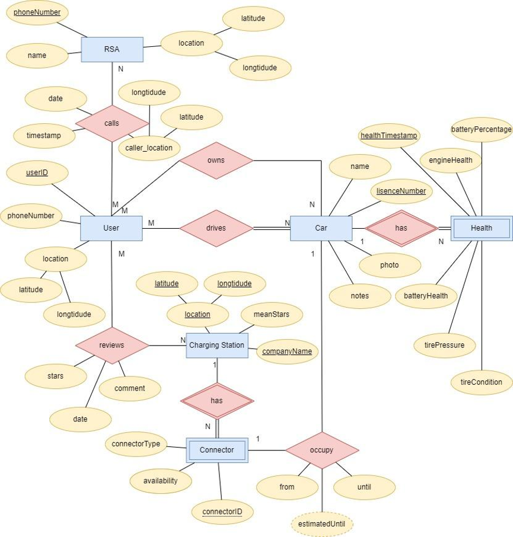
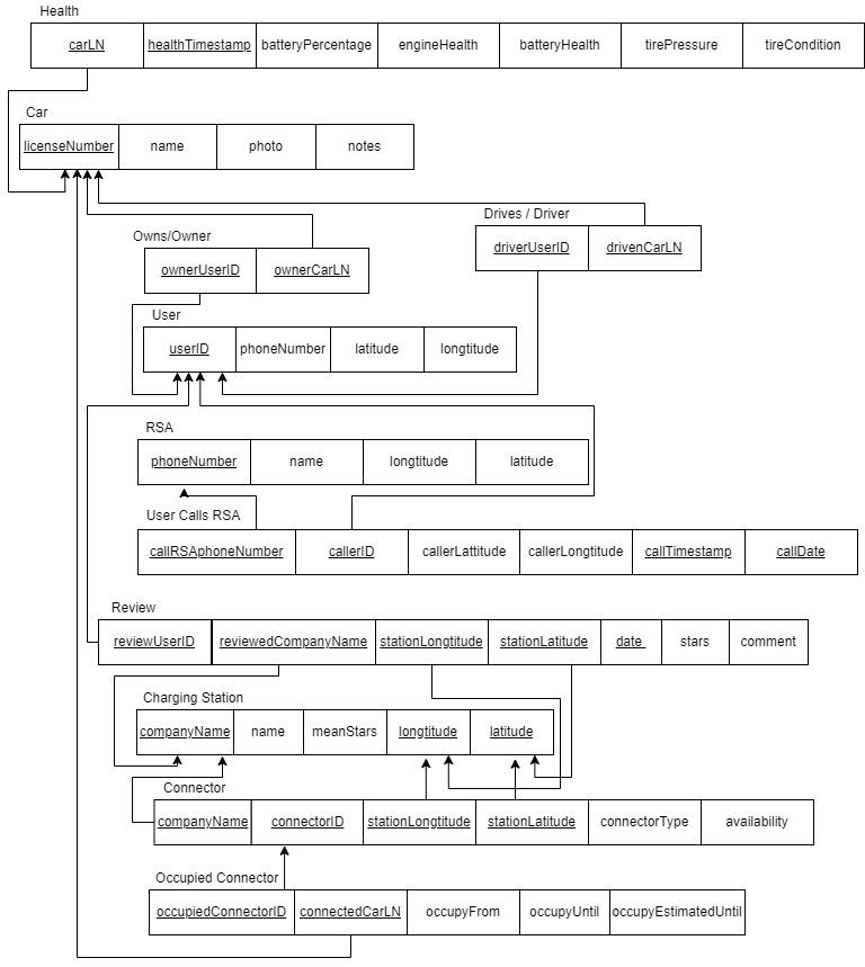

# EVPointDB design

This document condenses the design report (first deliverable) of the *Databases*
course project, written in Greek in November 2021 and corrected after grading.
It covers what the database has to store, who uses it, the entity-relationship
model, and the relational model that became `src/EVPoint_dump.sql`.

Where the implementation differs from the original report, the difference is
listed in [Differences between the report and the implementation](#differences-between-the-report-and-the-implementation).

## 1. Purpose and scope

EVPoint is a mobile web service that acts as a digital assistant for
electric-vehicle drivers in Greece. It stores three kinds of data:

- **Charging stations and their connectors**, which change constantly (a
  connector can be available, occupied or out of service) and are used
  heavily by the service.
- **The user's vehicle**, including diagnostics (battery, engine and tire
  state) that the app updates while it is in use.
- **Roadside assistance (RSA) providers**, a mostly static list. When a car
  reports a problem, or the driver presses a button, the service uses the
  driver's location to find the nearest provider.

Drivers can also review a station after using it.

The report estimated the following data volumes, based on 2020 figures for
Greece: about 100,000 registered vehicles, about 140,000 users (a vehicle can
have more than one user), about 186 charging stations with about 290
connectors, and about 500 charging sessions per day. These are design
estimates, not measurements.

## 2. User categories

| Category | What they can do |
|---|---|
| Administrator | Full access to all data, including users' contact details, and can create new roles. |
| Web service staff | Same data access as the administrator, but cannot create roles. |
| Developer | Can read the server code and see aggregate data sizes (for example, how many users exist) and company data, but not users' personal data. Cannot change the models or create roles. |
| Charging-station company | Manages its own stations: reads and updates station data and its company profile, and adds or removes connectors. |
| User | Manages their own profile and car data, sees station locations and company profiles, and can create, update and delete their own reviews. |

`src/users.sql` implements these categories as MySQL roles with example
accounts. See the README for the caveats about its placeholder credentials.

## 3. Entity-relationship model

*ER diagram (source: `EVP_ER.drawio`). Rectangles are entities (double
border: weak entity), ellipses are attributes (underlined: key), diamonds are
relationships.*

### 3.1 Entities

| Entity | Type | Attributes | Description |
|---|---|---|---|
| User | Strong | userID, phoneNumber, location (latitude, longtitude) | A person using the app. |
| Car | Strong | licenseNumber, name, photo, notes | A vehicle registered in the app. The license plate identifies it. |
| Health | Weak (depends on Car) | healthTimestamp, batteryPercentage, engineHealth, batteryHealth, tirePressure, tireCondition | One diagnostic reading of a car. |
| Charging Station | Strong | companyName, location (latitude, longtitude), meanStars (derived) | A site with several connectors that users can review. |
| Connector | Weak (depends on Charging Station) | connectorID, connectorType, availability | One charging socket at a station. |
| RSA | Strong | phoneNumber, name, location (latitude, longtitude) | A roadside-assistance provider. |

### 3.2 Relationships

| Relationship | Between | Cardinality | Participation | Attributes |
|---|---|---|---|---|
| drives | User, Car | M:N | User partial, Car total | none |
| owns | User, Car | M:N | User partial, Car partial | none |
| has | Car, Health | 1:N | Car total, Health total | none |
| has | Charging Station, Connector | 1:N | Charging Station total, Connector total | none |
| occupies | Car, Connector | 1:1 | both partial | from, until, estimatedUntil |
| reviews | User, Charging Station | M:N | both partial | stars, comment, date |
| calls | User, RSA | M:N | both partial | caller location, date, timestamp |

### 3.3 Assumptions and justifications

- **A user does not need a car.** The app is usable without registering a
  vehicle, so the user's participation in *drives* is partial.
- **A car does not need a registered owner.** The person who drives a car often
  is not the person it is registered to, and the registered owner may not use
  the app. So *owns* is optional on both sides, and *drives* and *owns* are
  separate relationships.
- **Several reviews per station.** A user can review the same station more than
  once, so the review's date is part of its key.
- **Only the latest location is used.** The user's location is updated
  while the app is in use. The server reads the most recent location for a
  given `userID`.
- **`estimatedUntil` is computed.** A server-side algorithm estimates when an
  occupied connector will be free again, from past sessions and the current
  state.
- **The license plate identifies a car.** This also makes it possible to look
  up further vehicle data (for example the engine serial number) in an
  external registry.
- **Three availability states.** A connector is available, occupied or out of
  service, so `availability` is an integer.
- **`meanStars` and `estimatedUntil` are derived.** `meanStars` is implemented
  as a view, not as a stored column. `estimatedUntil` is computed by the server
  and drawn with a dashed outline in the ER diagram.

## 4. Relational model

*Relational diagram (source: `EVP_RD.drawio`). Underlined attributes are
primary keys, arrows point from a foreign key to the key it references.*

### 4.1 Domains

| Domain | SQL type |
|---|---|
| User code | `CHAR(6)` |
| Vehicle license number | `CHAR(7)` |
| Connector code | `INT` |
| Connector type | `ENUM('Tesla TYPE 2', 'TYPE 2', 'CCS2')` |
| Short text (names) | `VARCHAR(25)` |
| Free text (notes, comments) | `VARCHAR(512)` |
| Rating (stars) | `INT` |
| Latitude / longitude | `DECIMAL(8,6)` |
| Diagnostic values | `DECIMAL(6,3)` |
| Date | `DATE` |
| Date and time | `TIMESTAMP` |

The report proposed the domains above in general terms. The implemented column
types are in `src/EVPoint_dump.sql`, and they are the reference if the two
differ.

### 4.2 Relations

Primary keys are underlined in the diagram; here they are marked with **PK**
and foreign keys with **FK**.

| Relation | Attributes | Keys |
|---|---|---|
| User | userID, phoneNumber, latitude, longtitude | PK: userID |
| Car | licenseNumber, name, photo, notes | PK: licenseNumber |
| Drives | driverUserID, drivenCarLN | PK: both columns. FK: driverUserID to User, drivenCarLN to Car |
| Owns | ownerUserID, ownerCarLN | PK: both columns. FK: ownerUserID to User, ownerCarLN to Car |
| Health | carLN, healthTimestamp, batteryPercentage, engineHealth, batteryHealth, tirePressure, tireCondition | PK: healthTimestamp, carLN. FK: carLN to Car |
| Charging Station | companyName, latitude, longtitude | PK: all three. |
| Connector | connectorID, connectorType, availability, station company name, latitude, longtitude | PK: connectorID. FK: station columns to Charging Station |
| Occupied Connector | occupiedConnectorID, connectedCarLN, occupiedFrom, occupiedUntil, occupiedEstimatedUntil | PK: occupiedConnectorID, connectedCarLN. FK: occupiedConnectorID to Connector, connectedCarLN to Car |
| Review | reviewUserID, station company name, latitude, longtitude, date, stars, comment | PK: user, station columns, date. FK: user to User, station columns to Charging Station |
| RSA | phoneNumber, name, longtitude, latitude | PK: phoneNumber |
| User calls RSA | callRSAphoneNumber, callerID, callerLatitude, callerLongtitude, timestamp | PK: callerID, callRSAphoneNumber, timestamp. FK: callRSAphoneNumber to RSA, callerID to User |

In SQL the tables are named `user`, `car`, `user_drives_car`, `user_owns_car`,
`health`, `chargingstation`, `connector`, `occupiedconnector`,
`user_reviews_chargingstation`, `rsa` and `user_calls_rsa`.

### 4.3 Views

| View | What it shows |
|---|---|
| `nearRSA` | For each user, the RSA providers close to them. |
| `nearAvailConnectors` | For each user, the available connectors at nearby charging stations. |
| `chargingStationMeanStars` | The average review rating of each station (the derived `meanStars`). |

"Near" is a bounding box in degrees of latitude and longitude around the user,
not a true distance. The original report used wide boxes (about 20 km for RSA
and 150 km for connectors, given as ±0.1° and ±0.75°). The published version
uses ±0.1° for RSA and ±0.05° (about 5 km) for connectors, because the sample
data is now real stations in a small area and 150 km would match everything.

### 4.4 Example queries

The report expressed these in relational algebra. Their SQL versions are in
`src/`, and the README lists them.

- Available connectors, with their type and company.
- The connectors of one station that are occupied, and when they are expected
  to be free.
- Charging stations that no user has reviewed.
- The best-rated station with an available connector near a given user.
- The state of the car of a given user.
- A union query: available CCS2 connectors together with available Tesla
  TYPE 2 connectors near a user. The report notes that an intersection was not
  needed because of De Morgan's laws, and the union is only a demonstration.

## Differences between the report and the implementation

- The text of the report gives the `Car` relation a `connectedConnectorID`
  column pointing at `Connector`. The relational diagram and the SQL do not
  have it: the link between a car and the connector it uses is the
  `occupiedconnector` table.
- The relational diagram (`EVP_RD.drawio`) shows `name` and `meanStars`
  columns on Charging Station. The SQL has neither: a station is identified by company name and
  coordinates, and `meanStars` is the `chargingStationMeanStars` view.
- The report's example data used simple made-up rows. The repository now
  ships an Open Charge Map snapshot with fictional users and reviews. See the
  README.
- `availability` in the sample data uses `1` for available and `-1` for
  occupied, as in the report's example tables (the occupied connector there has `-1`).
  The report only says there are three states and does not give the value of
  the third, so `0` for out of service is an assumption made in the sample data.
- Several names keep the spelling of the original schema (`longtitude`,
  `callerLattitude`). They are kept so that the diagrams, the report and the
  SQL stay consistent.
